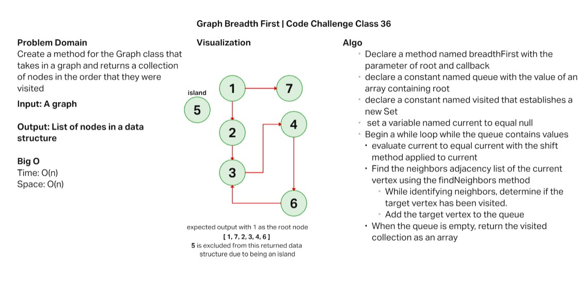

# Breadth First Graph Traversal

Create a method for the Graph class that takes in a graph and returns a collection of nodes in the order that they were visited

## Challenge

Write the following method for the Graph class:

* breadth first
  * Arguments: Node
  * Return: A collection of nodes in the order they were visited.
  * Display the collection

## Approach & Efficiency

My approach for this challenge was to utilize the Graph class that we created in class and to ensure that the breadth first traversal method met the requirements for this challenge.

The efficiency for both time and space for this method is O(n).

