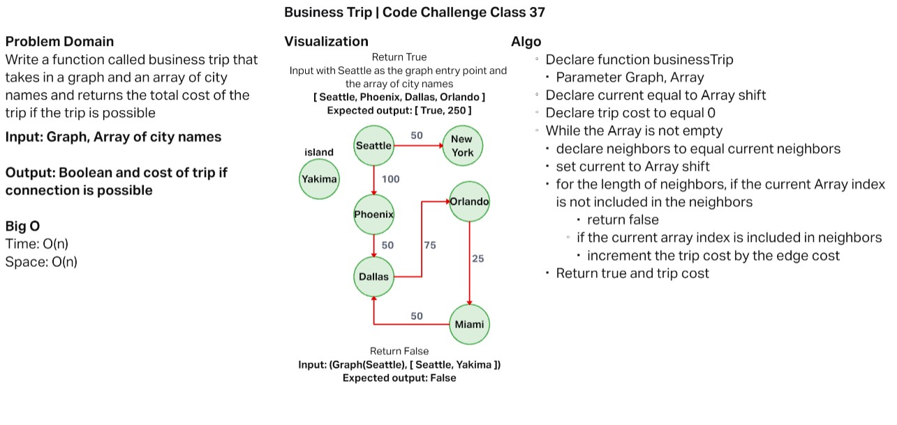

# Business Trip

Write a function called business trip that takes in a graph and an array of city names and returns the total cost of the trip if the trip is possible

## Challenge

Feature Tasks:

* Write a function called business trip
* Arguments: graph, array of city names
* Return: the cost of the trip (if it’s possible) or null (if not)

## Approach & Efficiency

My approach to this challenge was to iterate through the graph vertices while also taking into account edge weight between visited vertices. For the edges I did re-use the `addDirectedEdge` method from the graph class so that will limit me in terms of available trip routes. In order to be able to accurately create a round-trip trip versus a one-way trip, I would need to create a bi-directional edge method within the graph class.

The efficiency for both time and space for this method is O(n).

### [code](./businessTrip.js)

### [tests](./businessTrip.test.js)

### Test Results

