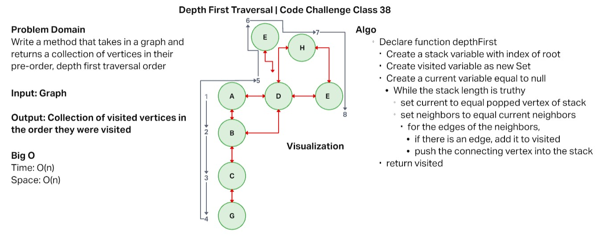
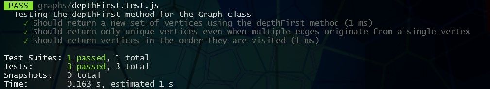

# Depth First Traversal of a Graph

## Author Robert Ball

## Challenge

Feature Tasks:

* Write the following method for the Graph class:

  * Name: Depth first
  * Arguments: Node (Starting point of search)
  * Return: A collection of nodes in their pre-order depth-first traversal order
  * Program output: Display the collection

## Approach & Efficiency

My approach to this challenge was to iterate through the graph vertices while also keeping track of unique vertices that had been visited. To do this I used the stack method of pushing visited vertices into a stack and then evaluating the the vertex has a neighbor when it is popped from the stack. The popped vertex is added to the visited list as a new Set.

The efficiency for both time and space for this method is O(n).



### [code](./graph.js)

### [tests](./depthFirst.test.js)

### Test Results



---

Test case given expected out of

```json
  [A, B, C, D, E, F, G, H]
```

```JS
  test('Should return vertices in the order they are visited', () => {
    let graph = new Graph();
    let a = graph.addVertex('A');
    let b = graph.addVertex('B');
    let c = graph.addVertex('C');
    let d = graph.addVertex('D');
    let e = graph.addVertex('E');
    let f = graph.addVertex('F');
    let g = graph.addVertex('G');
    let h = graph.addVertex('H');
    graph.addDirectedEdge(a, b);
    graph.addDirectedEdge(b, c);
    graph.addDirectedEdge(c, g);
    graph.addDirectedEdge(g, d);
    graph.addDirectedEdge(d, e);
    graph.addDirectedEdge(e, h);
    graph.addDirectedEdge(h, f);

    let results = graph.depthFirst(a);
    let values = Array.from(results);
    expect(values).toStrictEqual([a, b, c, g, d, e, h, f]);
  });
  ```