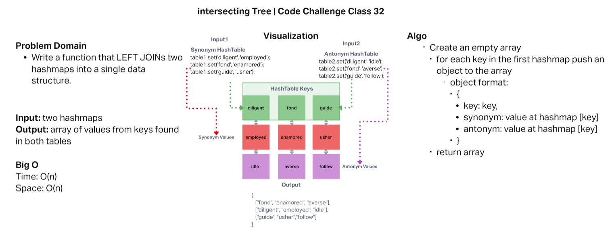
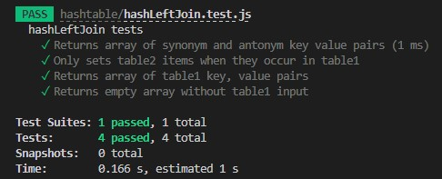

# HashTable Left Join

* Code Challenge Class 32: Implement a simplified LEFT JOIN for 2 Hashmaps..
* Author: Robert Ball
* Course: Code 401d48

---

## Challenge

### Write a function that LEFT JOINs two hashmaps into a single data structure.:

* Write a function called hashLeftJoin
* Arguments: two hash maps
  * The first parameter is a hashmap that has word strings as keys, and a synonym of the key as values.
  * The second parameter is a hashmap that has word strings as keys, and antonyms of the key as values.
* Return: The returned data structure that holds the results is up to you. It doesn’t need to exactly match the output below, so long as it achieves the LEFT JOIN logic

## Approach & Efficiency

* Efficiency
  * Time:
    * The big O of time will be `O(n)` due to having to traverse every key in the first hashtable

  * Space:
    * The big O of space will be `O(n)` which is dependant on the given table size

## Testing

[Code](hashtable/hashLeftJoin.js)

[Test](hashtable/hashLeftJoin.test.js)
