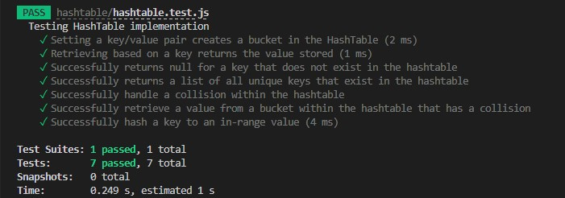

# Hashtables

* Code Challenge Class 30: Hash Table Implementation
* Author: Robert Ball
* Course: Code 401d48

---

## Challenge

### Implement a Hashtable Class with the following methods:

* set
  * Arguments: key, value
  * Returns: nothing
  * This method should hash the key, and set the key and value pair in the table, handling collisions as needed.
  * Should a given key already exist, replace its value from the value argument given to this method.

* get
  * Arguments: key
  * Returns: Value associated with that key in the table

* has
  * Arguments: key
  * Returns: Boolean, indicating if the key exists in the table already.

* keys
  * Returns: Collection of keys

* hash
  * Arguments: key
  * Returns: Index in the collection for that key

## Approach & Efficiency

* Approach
  * My approach to this challenge was to be able to successfully import previously completed code to fulfil the need of multiple linked list methods. Building upon the in-class demo, I implemented each required method for the new `Hashtable` class. I had created a simple hashtable function for a previous reading assignment so I was already familiar with the methods needed to complete this challenge.

* Efficiency
  * Time:
    * The big O of time will be `O(1)` in our use case due to not allowing multiple values to be inserted into the same hashtable index. If multiple values could be stored at the same index, big O could change to O(n) due to the potential for every value to be added to the same hashtable index

  * Space:
    * The big O of space will be `O(n)` which is dependant on the given table size

## API

```js
// all methods are applied using the HashTable class
class HashTable {
  constructor(size) {
    this.size = size;
    this.buckets = new Array(size);
  }
```

* `set(key, value)`: This method takes in the parameters key and value to insert a new item into a data structure

* `get(key)`: This method takes in a key and returns the value of the key if it is contained within the hashtable. If the key is not contained in the hashtable, this will return `null`

* `has(key)`: This method takes in a key and returns a boolean triggered when the passed key is or is not contained within the hastable

* `keys()`: This method returns all hashtable keys if there are keys within the hashtable

* `hash(key)`: This method takes in a key and will return a hashed value

## Testing

;
