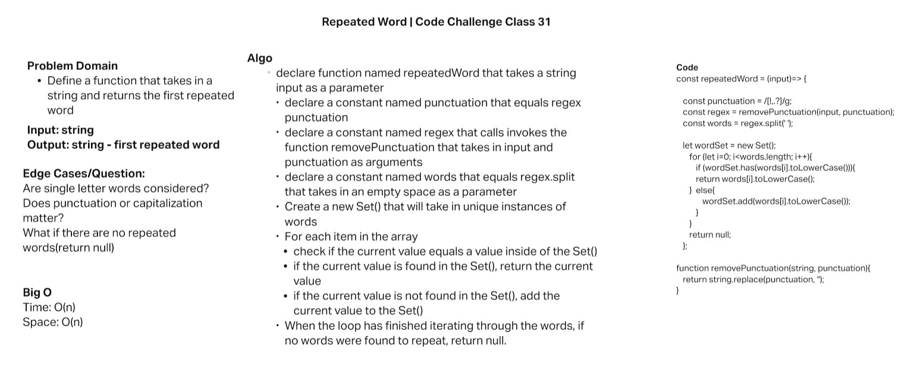
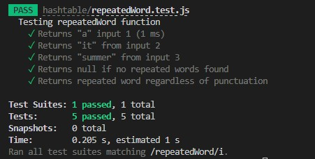

# Hashtables

* Code Challenge Class 31: Find the first repeated word in a book.
* Author: Robert Ball
* Course: Code 401d48

---

## Challenge

### Implement a Hashtable Class with the following methods:

* Write a function called repeated word that finds the first word to occur more than once in a string
  * Arguments: string
  * Return: string

## Approach & Efficiency

* Efficiency
  * Time:
    * The big O of time will be `O(n)` in our use case due to having to potentially iterate over each word within the input

  * Space:
    * The big O of space will be `O(n)` which is dependant on the given table size

## Testing

;
