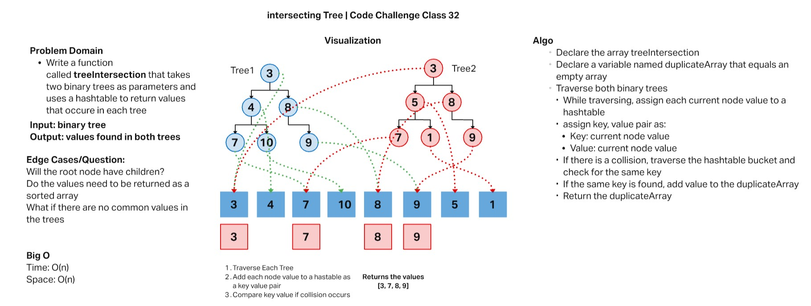
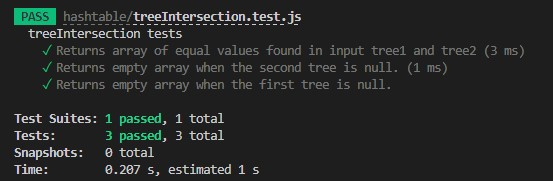

# Tree Intersection

* Code Challenge Class 32: Find similar values in two binary trees.
* Author: Robert Ball
* Course: Code 401d48

---

## Challenge

* Write a function called tree_intersection that takes two binary trees as parameters.
  * Arguments: two binary trees
  * Return: array of repeated words
* Using your Hashmap implementation as a part of your algorithm, return a set of values found in both trees.


## Approach & Efficiency




* Efficiency
  * Time: O(n)
    * This function will need to traverse both trees regardless of length

  * Space: O(n)
    * This is dependant on the given size of tree1 and tree2

### Code

```js
function treeIntersection(tree1, tree2){
  let newHashTable = new HashTable(100);
  let duplicateArray = [];
  addToTable(tree1.root, newHashTable);
  checkIntersections(tree2.root, newHashTable, duplicateArray);
  return duplicateArray;
}
```
This code depends on being able to incorporate the pre-established `LinkedList` class to be able to add key pair values to a new `HashTable`. The helper functions `addToTable` and `checkIntersections` use methods from the `HashTable` class


## Testing

;
