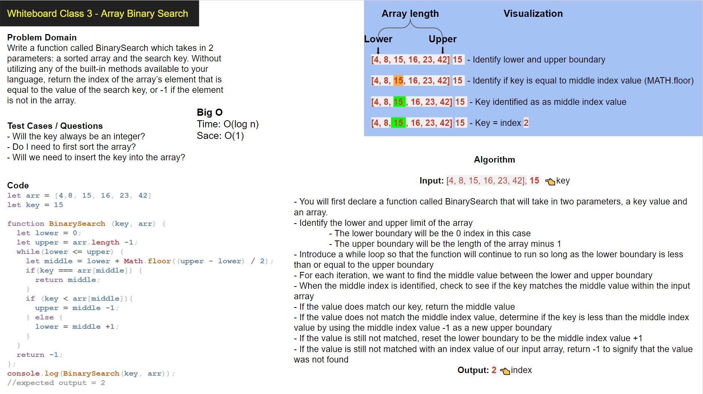

# Binary Search

Write a function called BinarySearch which takes in 2 parameters: a sorted array and the search key. Without utilizing any of the built-in methods available to your language, return the index of the array’s element that is equal to the value of the search key, or -1 if the element is not in the array.

## Whiteboard Process

## Approach & Efficiency

My initial approach to this problem was to iterate through the array using a for loop. I realized that a for loop would lead to a sequential search so I modified my solution to include a while loop. This reduced the Big O time factor significantly due to the solution constantly dividing the input array in half as it looks for an index value that matches the given key value.

Big O:

* Time Complexity: O(log n)

* Space Complexity: O(1)
