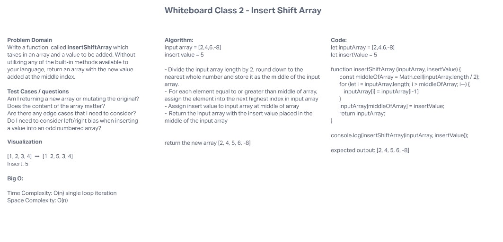

# Insert Shift Array

Write a function  called insertShiftArray which takes in an array and a value to be added. Without utilizing any of the built-in methods available to your language, return an array with the new value added at the middle index.

## Whiteboard Process

## Approach & Efficiency

My initial approach to this problem was to use the splice method in order to insert a value into an array. After seeing that we should not use built-in methods to solve this challenge, I decided to use the Math.ceil function to determine the middle of the array index.

Big O:

* Time Complexity: O(n)

* Space Complexity: O(n)

I worked with [Xavier Hillman](https://github.com/xhillman) for todays whiteboard challenge
