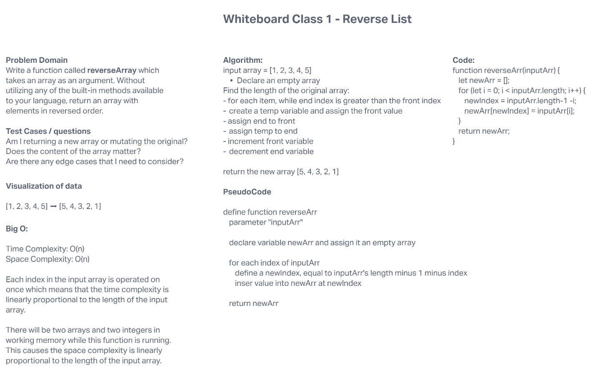

# Reverse an Array

Write a function called reverseArray which takes an array as an argument. Without utilizing any of the built-in methods available to your language, return an array with elements in reversed order.

## Whiteboard Process

## Approach & Efficiency

My approach was to make a simple solution based off of my JavaScript background. We've covered reversed lists previously so I wanted to focus more on my approach to whiteboarding versus getting too in-depth or overcomplicating a problem domain.

Big O:

* Time Complexity: O(n)

* Space Complexity: O(n)

  * Each index in the input array is operated on once which means that the time complexity is linearly proportional to the length of the input array.

  * There will be two arrays and two integers in working memory while this function is running. This causes the space complexity is linearly proportional to the length of the input array.
