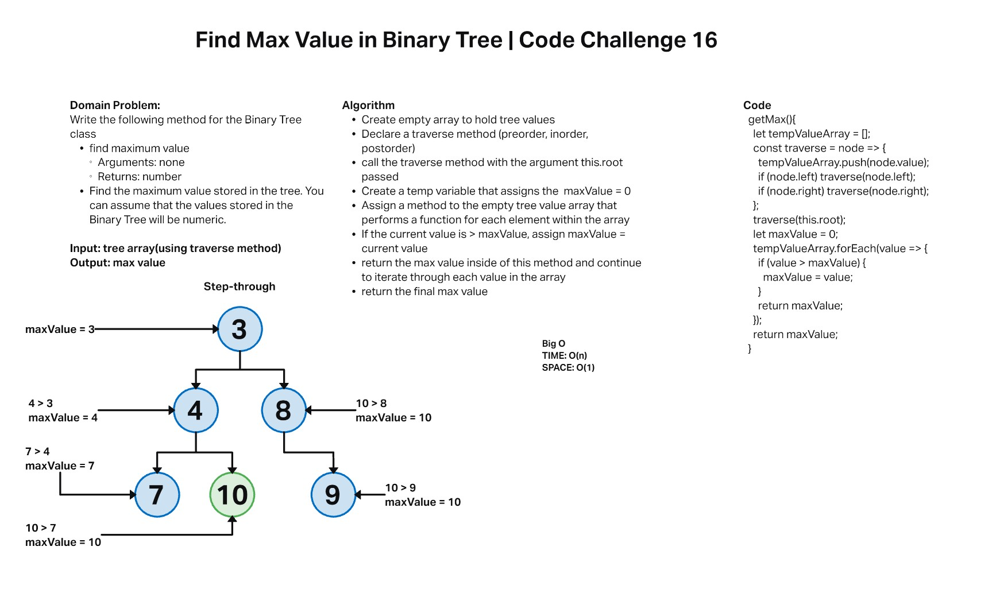

# Challenge Summary

Find the Maximum Value in a Binary Tree

## Feature Tasks

* Write the following method for the Binary Tree class

  * find maximum value
    * Arguments: none
    * Returns: number
  * Find the maximum value stored in the tree. You can assume that the values stored in the Binary Tree will be numeric.

## Whiteboard



## Approach & Efficiency

For this challenge I knew that I wanted to be able to create an array and then find the max value of that array when this method was instantiated. To accomplish this I assigned `tempValueArray` to qual an empty array and then incorporated the preorder traverse method to traverse the tree. As the method traverses the tree, `maxValue`, a placeholder variable is initially set to equal 0 and then uses an if statement to check if the current node value is greater than the current `maxValue`. If the node value is greater, the `maxValue` is then set to equal the current value. `maxValue` is then returned so that it can be used to check if the next node is greater than the newly assigned `maxValue`. After all node values have been traversed, `maxValue` is returned and will return the greatest value from the tree.

Time Efficiency: O(n)

Space Efficiency: O(1)

## API

* Classes

```JS

BinaryTree

//methods

.preOrder() // returns an array -> Return the root, traverse left subtree, traverse right subtree

.inOrder() // returns an array -> Traverse left subtree, return the root, traverse right subtree

.postOrder() // returns an array -> Traverse left subtree, traverse right subtree, return root

BinarySearchTree

//methods

.addNode() // takes in a value and adds it to the tree

.contains() // searches tree to find if a node value === passed value

.getMax() // searches tree and returns max value

```
