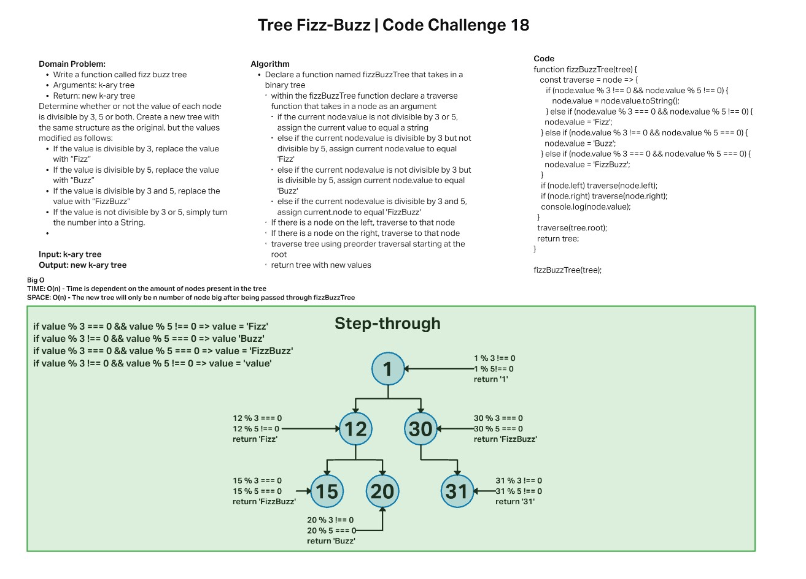

# Challenge Summary

Lab partner - [Stephen Martinez](https://github.com/SdMartinez13)


Conduct “FizzBuzz” on a k-ary tree while traversing through it to create a new tree.

Set the values of each of the new nodes depending on the corresponding node value in the source tree.

## Feature Tasks

* Write a function called fizz buzz tree
  * Arguments: k-ary tree
  * Return: new k-ary tree
* Determine whether or not the value of each node is divisible by 3, 5 or both. Create a new tree with the same structure as the original, but the values modified as follows:

* If the value is divisible by 3, replace the value with “Fizz”
* If the value is divisible by 5, replace the value with “Buzz”
* If the value is divisible by 3 and 5, replace the value with “FizzBuzz”
* If the value is not divisible by 3 or 5, simply turn the number into a String.

## Whiteboard



## Approach & Efficiency

For this challenge I initially started with writing out the necessary logic to assign a value to equal a specific string depending on if it is divisible by 3, 5, both or none. This logic completed the requirements of assigning values to equal `Fizz`, `Buzz`, `FizzBuzz`, or `<original value as a string>`. From there the only thing left to do is assign a traverse method and evaluate each node value. Once all node values have been evaluated, the return statement will return a new tree that contains the output of passing each original node value through the `FizBuzz` function.

Time Efficiency: O(n)

Space Efficiency: O(n)

## API

* Classes

```JS

BinaryTree

//methods

.preOrder() // returns an array -> Return the root, traverse left subtree, traverse right subtree

.inOrder() // returns an array -> Traverse left subtree, return the root, traverse right subtree

.postOrder() // returns an array -> Traverse left subtree, traverse right subtree, return root

BinarySearchTree

//methods

.addNode() // takes in a value and adds it to the tree

.contains() // searches tree to find if a node value === passed value

.getMax() // searches tree and returns max value

.fizzBuzzTree() // evaluates node.value and returns Fizz, Buzz, FizzBuzz or the value as a string

```
