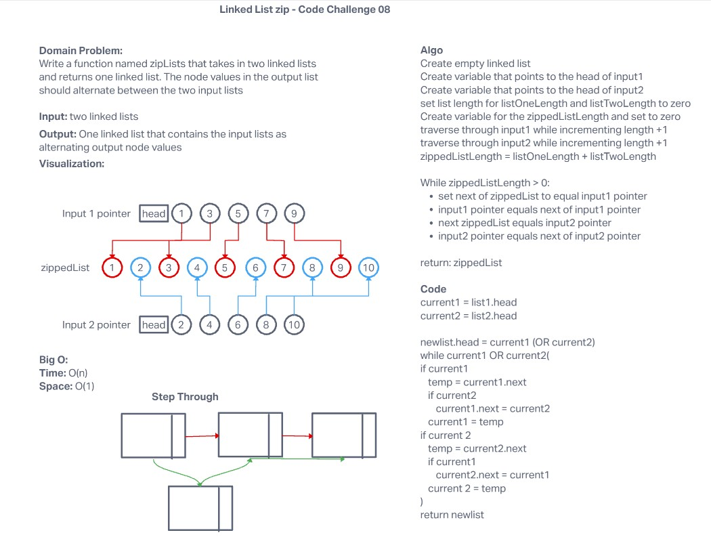

# Challenge Summary

 Write a function named zipLists that takes in two linked lists and returns one linked list. The node values in the output list should alternate between the two input lists


## Whiteboard Process



## Approach & Efficiency

My initial thought process was to solve this challenge by traversing two input lists and combining their results into a new zipList. This approach was flawed as I did not account for the potential of different sized input lists. After accounting fo potential errors due to different length lists, a simple, but so no elegant, solution is to create a temporary variable that can be assigned to either list. This is used as a check to determine if the next value of the current input node is null, if so it will then continue to loop through the remaining nodes in the second input.

Time Efficiency: O(n)

Space Efficiency: O(1)

Code:

```js
  zipLists(currentNodeList) {
    let input1 = this.head;
    let input2 = currentNodeList.head;
    while (input1 !== null && input2 !== null) {
      let next = input1.next;
      input1.next = input2;
      input1 = input2;
      input2 = next;
    }
  }
```

Testing:

```js
'use strict';

const LinkedList = require(<LinkedListConstructor>);

let input1 = new LinkedList();
input1.insert(1);
input1.insert(3);
console.log(input1.toString());

let input2 = new LinkedList();
input2.insert(2);
input2.insert(6);
input2.insert(8);

describe('Test zip list', () => {
  test('Should zip two lists', () => {
    input1.zipLists(input2);
    expect(input1.toString()).toEqual('{3} -> {8} -> {1} -> {6} -> {2} -> NULL');
  });
});
```
