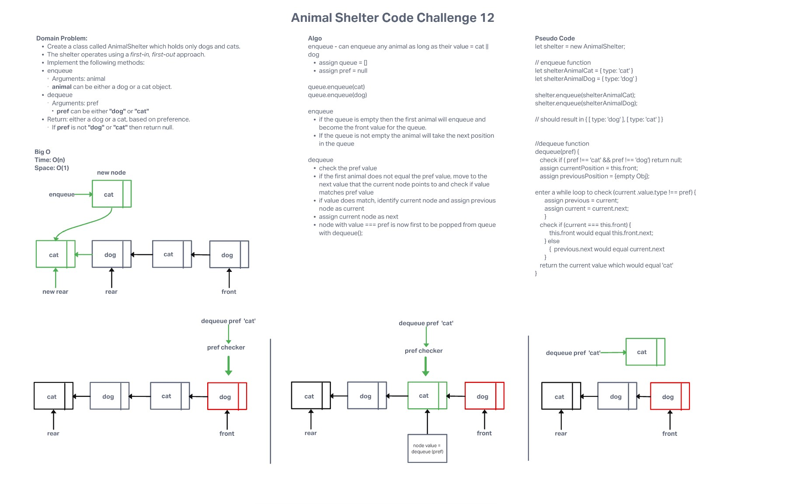

# Challenge Summary

Implement a Queue using two Stacks.

### Lab Partners: [Allie Dunkle](https://github.com/AllieDunkel)

### Requirements

* Create a class called AnimalShelter which holds only dogs and cats.
* The shelter operates using a first-in, first-out approach.
* Implement the following methods:
  * enqueue
    * Arguments: animal
    * animal can be either a dog or a cat object.
  * dequeue
    * Arguments: pref
    * pref can be either "dog" or "cat"
  * Return: either a dog or a cat, based on preference.
    * If pref is not "dog" or "cat" then return null

## Approach & Efficiency

---

The biggest hurdle that we faced during this challenge was determining how to correctly check for the `pref` value when checking the node values inside of the queue. The `enqueue` function seemed fairly straight forward in that it would only allow a value of `cat` or `dog` to enter into the queue. The `dequeue` function needed to have an additional step to be able to reassign the previous node value to === the current node value. This would allow you to move the node that matches the `pref` value to the front of the queue to be dequeued.

Time Efficiency: O(n)

Space Efficiency: O(1)

