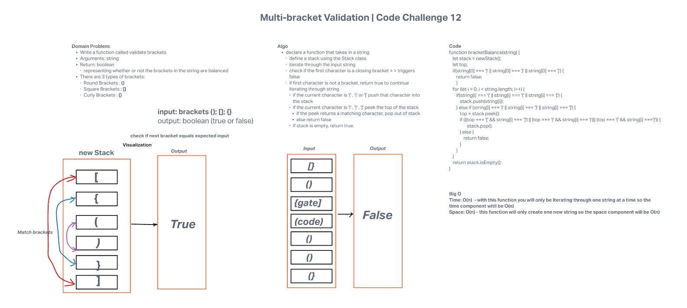

# Challenge Summary

Implement a function that validates that all brackets within a string are balanced.

### Lab Partners: [Timothee Odushina](https://github.com/timothee2022)

### Requirements

* Write a function called validate brackets
  * Arguments: string
  * Return: boolean
    * representing whether or not the brackets in the string are balanced

* There are 3 types of brackets:

  * Round Brackets : `()`
  * Square Brackets : `[]`
  * Curly Brackets : `{}`

## Approach & Efficiency

---

For this challenge I had initially decided to utilize regex as a character validator but ultimately went with creating a function that identifies node values using the `.peek()` and `.pop()` methods. The function works by identifying any string that has an `index[0] === '}' || ']' || ')'` as false due to the string being immediately unbalanced due to syntax.
From there the function will then complete a for loop on the string and identify all `bracket` notation. When an opening `bracket` is identified, the function will continue and When a closing `bracket` is identified, the function will evaluate if the next `bracket` is a closing bracket.

Time Efficiency: O(n)

Space Efficiency: O(n)
