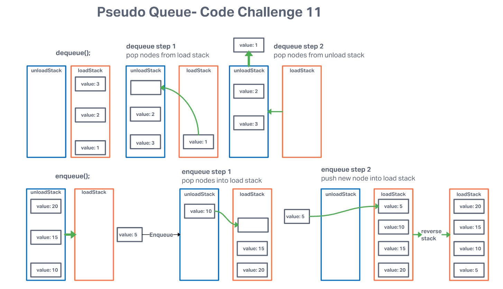

# Challenge Summary

Implement a Queue using two Stacks.

## Lab Partners: [Stephen Clemmer](https://github.com/stephenclemmer) and [TJ Parker](https://github.com/tj-parker)

## Requirements

* Create a new class called pseudo queue.
  * Do not use an existing Queue.
  * Instead, this PseudoQueue class will implement our standard queue interface (the two methods listed below),
  * Internally, utilize 2 Stack instances to create and manage the queue
* Methods:
  * enqueue
  * Arguments: value
  * Inserts value into the PseudoQueue, using a first-in, first-out approach.
* dequeue
  * Arguments: none
  * Extracts a value from the PseudoQueue, using a first-in, first-out approach.

## Approach & Efficiency

---

From the in-class slinky analogy it seemed like the best method to be able to enable FIFO capability without using a queue would be to use two stack instances that you would then be able to move nodes within. By identifying two separate stacks, you are able to access the first node entered into one stack by using the `.pop()` method to remove all nodes prior to the node that you want to access. When all of the nodes have been popped from the `loadStack` then you can use the `.push()` method to extract the top node that used to be the bottom node.

Time Efficiency: O(n)

Space Efficiency: O(1)
