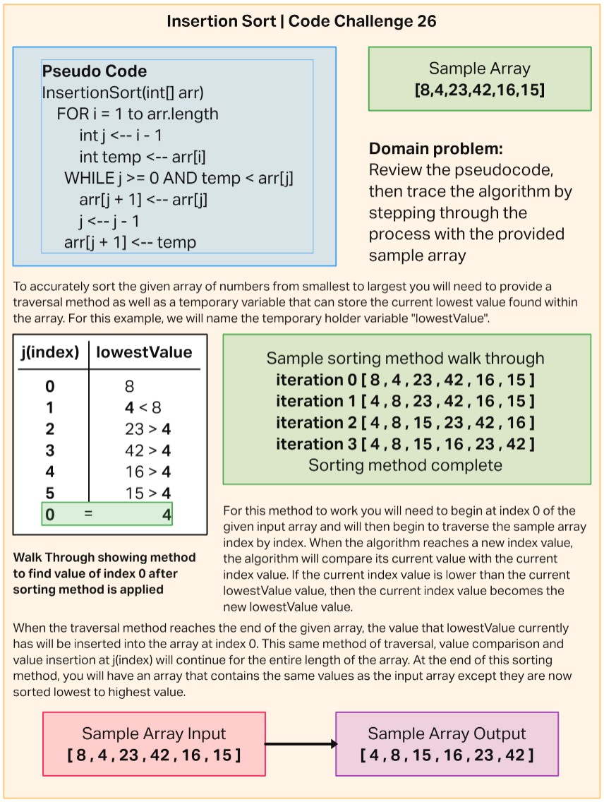

# Blog Notes: Insertion Sort

Review the pseudocode below, then trace the algorithm by stepping through the process with the provided sample array. Document your explanation by creating a blog article that shows the step-by-step output after each iteration through some sort of visual.

Once you are done with your article, code a working, tested implementation of Insertion Sort based on the pseudocode provided.

## Whiteboard Blog



---

## Javascript insertion sort implementation

```js
const insertionSort = (arr) => {
  for (let i = 1; i < arr.length; i++) {
    let j = i - 1;
    let lowestValue = arr[i];
    while ((j > -1) && (lowestValue < arr[j])) {
      arr[j + 1] = arr[j];
      j--;
    }
    arr[j + 1] = lowestValue;
  }
  return arr;
};
```

## Testing insertion sort method

```js
const {insertionSort} = require('./insertionSort');

let sampleArr = [8,4,23,42,16,15];

describe('This tests the ability to sort an array based on index values', () => {
  it('Should sort the array in ascending value order', () => {
    let insertSortTest = insertionSort(sampleArr);
    expect(insertSortTest).toEqual([4,8,15,16,23,42]);
  });
});
```
