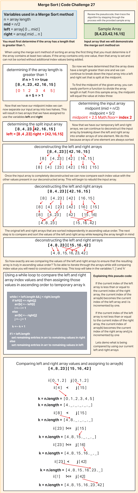

# Blog Notes: Merge Sort

Review the pseudocode below, then trace the algorithm by stepping through the process with the provided sample array. Document your explanation by creating a blog article that shows the step-by-step output after each iteration through some sort of visual.

Once you are done with your article, code a working, tested implementation of Merge Sort based on the pseudocode provided.

```html
ALGORITHM Mergesort(arr)
    DECLARE n <-- arr.length

    if n > 1
      DECLARE mid <-- n/2
      DECLARE left <-- arr[0...mid]
      DECLARE right <-- arr[mid...n]
      // sort the left side
      Mergesort(left)
      // sort the right side
      Mergesort(right)
      // merge the sorted left and right sides together
      Merge(left, right, arr)

ALGORITHM Merge(left, right, arr)
    DECLARE i <-- 0
    DECLARE j <-- 0
    DECLARE k <-- 0

    while i < left.length && j < right.length
        if left[i] <= right[j]
            arr[k] <-- left[i]
            i <-- i + 1
        else
            arr[k] <-- right[j]
            j <-- j + 1

        k <-- k + 1

    if i = left.length
       set remaining entries in arr to remaining values in right
    else
       set remaining entries in arr to remaining values in left
```

## Whiteboard Blog



---

## Javascript insertion sort implementation

```js
function mergeSort(array) {

  if (array.length > 1) {
    let temp = [...array];
    let mid = Math.ceil(array.length / 2);
    let left = temp.splice(0, mid);
    let right = temp;

    left = mergeSort(left);
    right = mergeSort(right);
    return merge(left, right);
  } else {
    return array;
  }
}
function merge(left, right) {
  let result = [];
  while (left.length > 0 && right.length > 0) {
    if (left[0] <= right[0]) {
      result.push(left.shift());
    } else {
      result.push(right.shift());
    }
  }
  if (left.length === 0) {
    result.push(...right);
  } else {
    result.push(...left);
  }
  return result;
}
```

## Testing insertion sort method

```js
const {mergeSort} = require('./mergeSort');

let sampleArr = [8,4,23,42,16,15];

describe('This tests the ability to sort an array based on index values', () => {
  it('Should sort the array in ascending value order', () => {
    let insertSortTest = mergeSort(sampleArr);
    expect(insertSortTest).toEqual([4,8,15,16,23,42]);
  });
});
```
