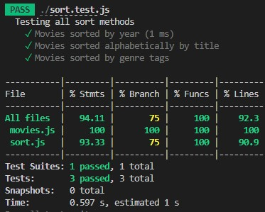

# Code Challenge Class 28 - Movie Sort

## Domain Problem

- Implement several array sorting comparators and an array filter.

## Feature Tasks

- Implement the functions `sortYear`, `sortTitle`, and `inGenre` in the file `sort.js`.

  - Execute your tests while developing using `npm run watch`
  - Execute your tests in CI using `npm test`

- Functions:
  - sortYear
    - Arguments: `movies` array
    - Sorts the input array by year, in ascending order.
  - sortTitle
    - Arguments: `movies` array
    - Sorts the input array by title, ignoring `"The "` at the beginning of titles.
  - inGenre
    - Arguments: `movies` array, `genre` string
    - Filters the input array, returning only those movies who include `genre`.

- Extract the comparator callbacks
  - sortYear and sortTitle should both be implemented by passing a custom comparison function to the built-in sort utility.
  - Export these helper functions at the top level of your file, and call them from your sortYear and sortTitle functions.
  - Import these helper functions into your test, and write tests that verify they return the appropriate comparison values (<0, 0, or >0).

---

> in-class code challenge demo and assets used as reference for sorting method code / tests
>
>*[class repo](https://github.com/codefellows/seattle-code-javascript-401d48/tree/main/class-28/challenge)*

## Approach for each sorting method

### **Sort the movie array by year**

For this sorting method we need to determine if the year a movie released is `> || < || =` another given year. To do this we need to look at the movie data and see that each movie object has a key "year" that has a year as the assigned value. From here you need to create a movie object with the following method: `.sort(previous, current)`. That will then let you reach the movie object "year" key and extract it's value. From here you take the result of `previous.year - current.year` and can then add that object to an array sorted in ascending numerical order

```js
function sortYear(movies) {
  movies.sort((previous, current) => previous.year - current.year);
  return movies;
}
```

### **Sort the movie array by title**

For this sorting method you will also use the `.sort();` method on another movie object. You will again assign previous and current as arguments for `.sort()`. Because we are going to be comparing the titles of two movies at a time we can establish the const of `title1` and const of `title2` to give ourselves a placeholder for the movie titles. One thing that needs to be addressed is how to deal with movies that begin with the word `'The'`. With this sorting method we want to replace any instance of `'The'` (from the movie titles) with a blank string `''` so that we can have our sorting method look past any instances of `'The'` and sort by the character immediately following `'The'`. From there we then compare the two titles and assign a specified integer `( -1 (on the left), 1 (on the right), 0 (neither left nor right))` that will be returned. This function will then return an array of movies sorted by title and also ignoring the word `'The'`.

```js
function sortTitle(movies) {
  movies.sort((previous, current) => {
    const title1 = previous.title.replace('The ', '').toLowerCase();
    const title2 = current.title.replace('The ', '').toLowerCase();
    if(title1 < title2) return -1;
    if(title1 > title2) return 1;
    return 0;
  });
  return movies;
}
```

### **Sort the movie array by genre**

We can approach this sorting method in a very similar way that we approached sorting the movies by year. Each movie has a genre key value pair that we can access in the same way that the movie year was accessed. In this case, rather than using `.sort();`, we want to use `.filter();` so that we can target values that are assigned to the genre key within our movie object. Once the genre values have been reached, any movies with a matching genre value will be returned.

```js
function inGenre(movies, genre) {
  return movies.filter(movie => movie.genres.includes(genre));
}
```

## Testing

The sortYear test is used to verify that the returned array has all movie objects sorted by movie year in ascending order. The expected result from this function will be an array of movies from `movies.js` sorted by year.

```js
  it('Movies sorted by year', () => {
    const movies = sortYear(Movies);
    expect(movies.map((m) => m.title)).toEqual(
      [
        ...
      ]
    );
  });

```

The sortTitle test is used to verify that the returned array has all movie objects sorted by title in ascending order. The expected result from this function will be an array of movies from `movies.js` sorted by title while also ignoring `'The'` when sorting a-z.

```js
  it('Movies sorted alphabetically by title', () => {
    const movies = sortTitle(Movies);
    expect(movies.map((m) => m.title)).toEqual(
      [
        ...
    );
  });
```

The inGenre test is used to verify that the returned array has all movie objects that contain the same genre values. To test this we pass an argument to inGenre that contains a Movie object and a a genre value that we want to find. In this test we are looking for movies in the `'Thriller'` genre. The expected result from this function will be an array of movies from `movies.js` that fall within the same genre.

```js
  it('Movies sorted by genre tags', () => {
    const movies = (inGenre(Movies, 'Thriller'));
    expect(movies.map((m) => m.title)).toEqual(
      [
        ...
      ]
    );
  });
```

